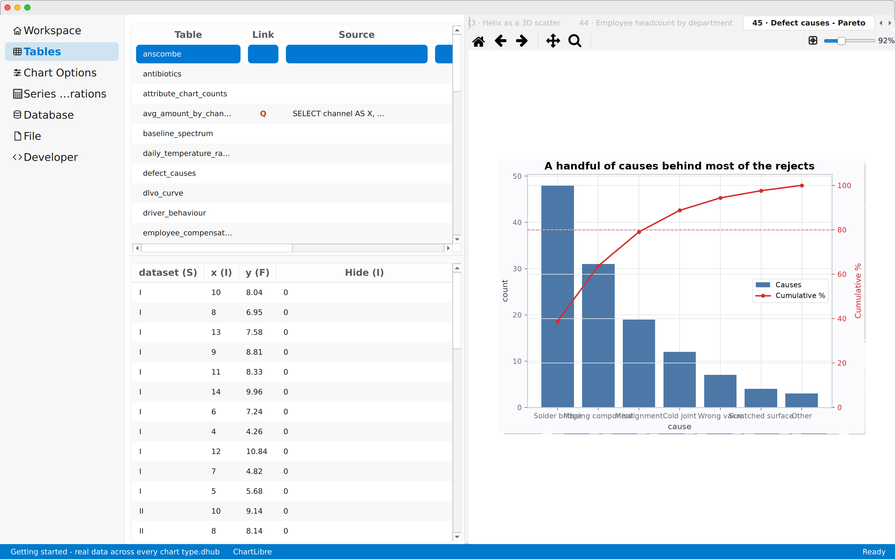

# ChartLibre

**A free, open-source desktop application for turning data into scientific charts — without writing code, and without a licence fee.**

Scientific charting software is usually the expensive part of a small lab's or a student's toolchain. ChartLibre covers the everyday ground those packages are bought for — import a dataset, query it, plot it, fit it, export it at publication resolution — as a plain MIT-licensed desktop application you install and use for free, on Windows, macOS and Linux.

It is built on Matplotlib, so the charts are Matplotlib charts: the same output a Python script would produce, reached through a GUI instead of code.



---

## Why it exists

If you need to plot measurements, fit a curve, find peaks in a spectrum or build a control chart, the usual options are a commercial package (Origin, SigmaPlot, Prism, Igor Pro, KaleidaGraph), a spreadsheet that was never meant for it, or writing Matplotlib by hand every time.

ChartLibre aims at the first of those without the price tag:

- **Free of charge, and free to modify** — MIT licence, no tiers, no seats, no activation, no account.
- **No code required** — every chart, fit and transformation is a dialog. The data stays queryable in SQL when you want that power.
- **Your file stays yours** — a project is one `.dhub` file (a SQLite database) holding *both* the data and every chart definition built on it. Copy it, email it, commit it to git. No proprietary container, no cloud, no lock-in: any SQLite tool can read the data back out.
- **Publication output** — export to PNG, JPEG, **SVG** and **PDF** at a DPI you choose.

> **Status: early.** ChartLibre is at version 0.1.0 and under active development. It is genuinely usable — the feature list below is what is implemented and covered by the test suite, not a roadmap — but expect rough edges, and check results that matter.

---

## What it does

### Charts — 34 types

| Family | Types |
|---|---|
| **Pairwise (x, y)** | Bar, Horizontal Bar, Broken Bar (+ vertical), Scatter, Fill Between, Stack Plot, Stem, Table, Text, Time Series, Timeline |
| **Statistical distributions** | Histogram, Box, Violin, ECDF, Stairs, Pareto, Pie, Hexbin, Event Plot |
| **Gridded data** | Contour, Heatmap, Quiver, Stream Plot, Wind Barbs |
| **Irregularly gridded** | Contour (scattered), Triangular Mesh, Triangular Colour Mesh |
| **3D and volumetric** | Surface, Surface (scattered), 3D Scatter, 3D Line, 3D Bar |

Multiple axes per figure, multi-axis layout presets (shared scale, main + secondary, overlapping), annotations and reference lines, and an interactive canvas for measuring, annotating and selecting points.

### Analysis — 18 series operations

Peaks · Roots · Calculus · Statistics · Outliers · Clustering · Regression · GP Regression · Transform · Decomposition · Control Chart · Smoothing · Spectral Analysis · Filtering · Baseline Correction · Fit · Interpolation · Function

Each previews its result on the chart before anything is committed. Highlights:

- **Fit** — Gaussian, exponential, polynomial, your own functions; optional residual and measured-vs-fit charts.
- **Filtering / Spectral Analysis** — Butterworth, Chebyshev, Bessel, FIR; PSD, coherence, cross-correlation, Hilbert envelope.
- **Control Chart** — I-MR, X-bar-R, X-bar-S, p, np, c, u with rule violations flagged.
- **Outliers / Regression / Clustering** — classical criteria plus scikit-learn models (Isolation Forest, LOF, One-Class SVM, RANSAC, Huber, Random Forest, k-means, DBSCAN).
- **Surfaces** — Fit, Peaks, Roots and Calculus also work on `z = f(x, y)` series: surface models, 2D local extrema, traced level curves, gradient and volume.

### Data in and out

- **Import** — CSV/TSV/TXT, Excel (`.xlsx`, `.xlsm`, `.xls`), JSON, XML, clipboard paste, web URLs, and databases: SQLite, another `.dhub`, **PostgreSQL** and **MySQL** (a table or your own `SELECT`).
- **Re-read** — any imported table keeps its link and can be refreshed from the original source in one click. Passwords are never stored in the project file.
- **Export** — tables to CSV or Excel; charts to PNG, JPEG, SVG or PDF.
- **SQL Query Builder** — write, test and save queries that behave like tables anywhere a table is accepted.

### Make it yours

- **Matplotlib style editor** — edit rcParams and save `.mplstyle` files.
- **Extensible without forking** — drop a Python file into `user/charts/`, `user/series_operations/` or `user/functions/` and it appears in the application. GUI scaffolding tools generate a working skeleton for each.
- **Localisation** — English and Italian (complete), with a built-in catalogue editor for adding more.

---

## Installation

Requires **Python 3.11+**.

```bash
git clone https://github.com/ebelland/ChartLibre.git
cd ChartLibre
pip install -r requirements.txt
python main.py
```

On first launch ChartLibre asks whether to create a new project, open an existing one, or **load a demo**. Twenty-one demo projects ship with it, each a complete worked example — start there.

<details>
<summary>Linux: extra system packages</summary>

Qt needs a few libraries that may not be present on a minimal install:

```bash
sudo apt install libegl1 libgl1 libxkbcommon0 libdbus-1-3 libfontconfig1
```
</details>

---

## Documentation

| | |
|---|---|
| [**User manual**](docs/manual/user_manual.pdf) | The whole application, chapter by chapter (PDF). |
| [**Developer guide**](docs/DEVELOPMENT.md) | Architecture, the render pipeline, and how to add a chart type or an operation. |
| [`todo.txt`](todo.txt) | Known issues and what is being worked on, ranked. |

## Built with

[PySide6](https://doc.qt.io/qtforpython/) (Qt 6) · [Matplotlib](https://matplotlib.org/) · [NumPy](https://numpy.org/) · [pandas](https://pandas.pydata.org/) · [SciPy](https://scipy.org/) · [scikit-learn](https://scikit-learn.org/) · [statsmodels](https://www.statsmodels.org/) · SQLite

## Contributing

Issues and pull requests are welcome. The test suite runs with:

```bash
python -m pytest app/tests -q          # add QT_QPA_PLATFORM=offscreen when headless
```

Please read [`docs/DEVELOPMENT.md`](docs/DEVELOPMENT.md) first — it explains the conventions the codebase actually follows.

## Licence

[MIT](LICENSE) © 2026 Enrico Bellandi. Free to use, modify and redistribute, including commercially.

*Product names mentioned above are trademarks of their respective owners and are named only to describe the kind of tool ChartLibre is an alternative to.*
