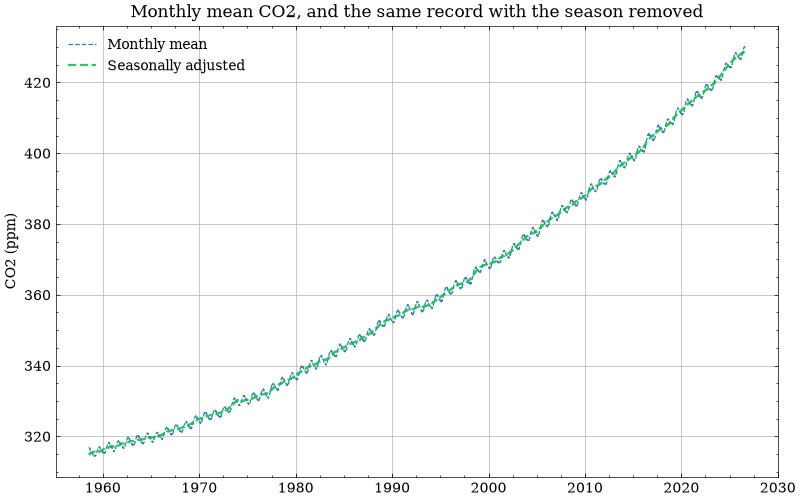
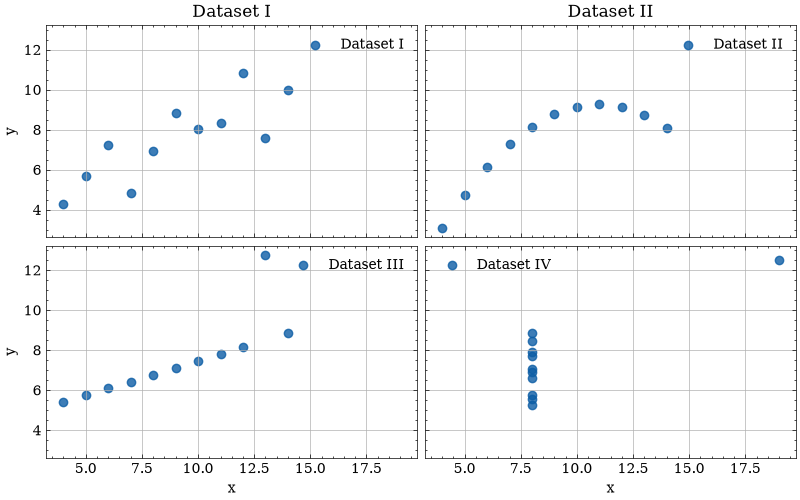
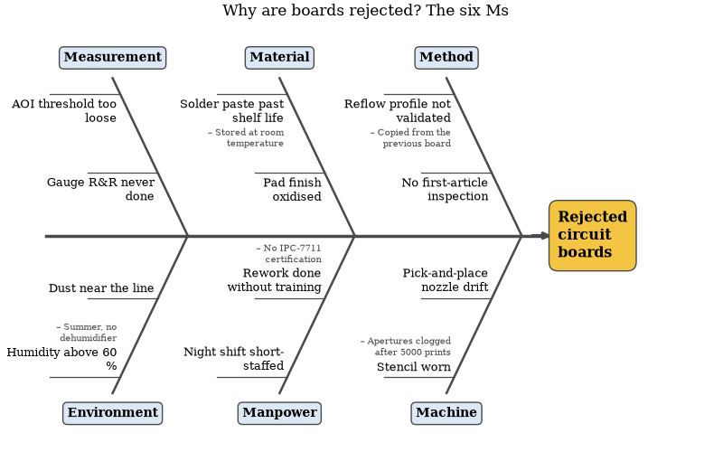
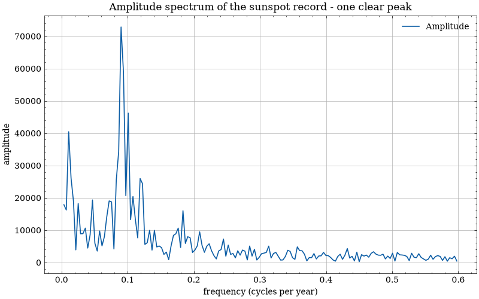
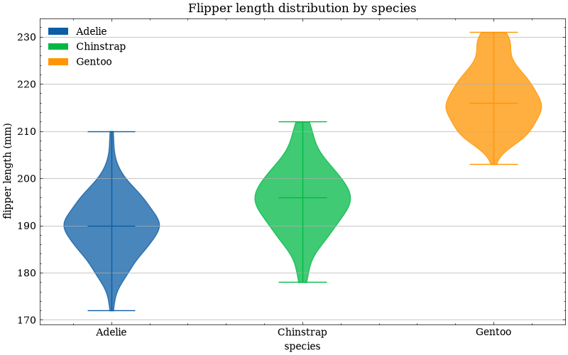
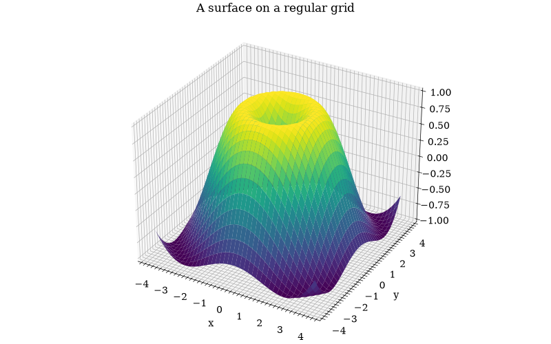
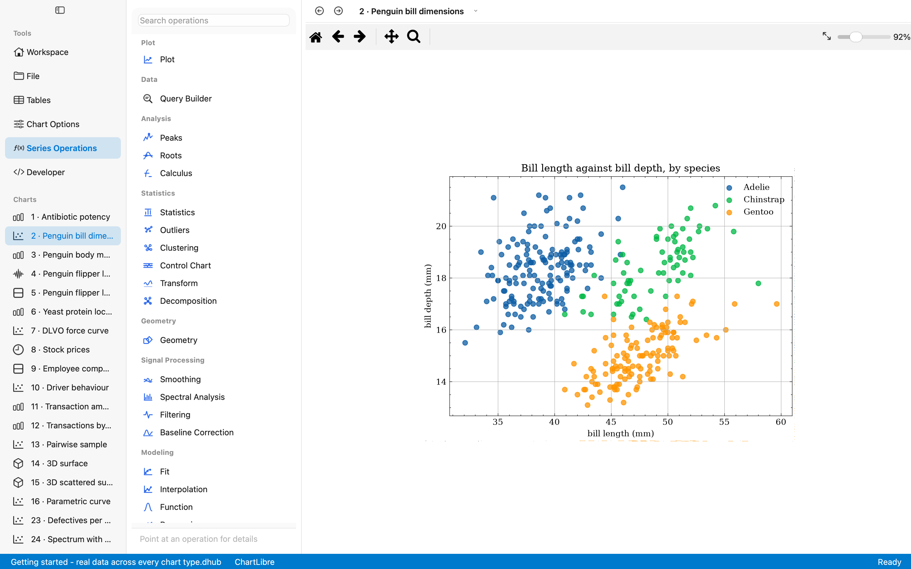

# ChartLibre

**A free, open-source desktop application for turning data into scientific charts — without writing code, and without a licence fee.**

Scientific charting software is usually the expensive part of a small lab's or a student's toolchain. ChartLibre covers the everyday ground those packages are bought for — import a dataset, query it, plot it, fit it, export it at publication resolution — as a plain MIT-licensed desktop application you install and use for free, on Windows and macOS.¹

It is built on Matplotlib, so the charts are Matplotlib charts: the same output a Python script would produce, reached through a GUI instead of code.


<table>
  <tr>
    <td></td>
    <td></td>
    <td></td>
  </tr>
  <tr>
    <td></td>
    <td></td>
    <td></td>
  </tr>
</table>

<sub>All six are demo projects that ship with the application, drawn by ChartLibre itself in its default style.</sub>

---

## Why it exists

If you need to plot measurements, fit a curve, find peaks in a spectrum or build a control chart, the usual options are a commercial package (Origin, SigmaPlot, Prism, Igor Pro, KaleidaGraph), a spreadsheet that was never meant for it, or writing Matplotlib by hand every time.

ChartLibre aims at the first of those without the price tag:

- **Free of charge, and free to modify** — MIT licence, no tiers, no seats, no activation, no account.
- **No code required** — every chart, fit and transformation is a dialog. The data stays queryable in SQL when you want that power.
- **Your file stays yours** — a project is one `.dhub` file (a SQLite database) holding *both* the data and every chart definition built on it. Copy it, email it, commit it to git. No proprietary container, no cloud, no lock-in: any SQLite tool can read the data back out.
- **Publication output** — export to PNG, JPEG, **SVG** and **PDF** at a DPI you choose.

> **Status: early, and not thoroughly tested.** ChartLibre is at version 0.1.0 and under active development. The feature list below is what is implemented and covered by the automated test suite, not a roadmap — but it has had little testing by real users on real data yet. Expect rough edges, and check results that matter.
>
> **Collaborators wanted.** Testers, bug reports, fixes, translations, a Linux check, packaging: see [Contributing](#contributing).

> **How it was made.** ChartLibre was written mostly by [Claude](https://www.anthropic.com/claude), Anthropic's AI model, working in conversation with the author, who designed it, set its direction and tested it. The *Credits* window in the application says the same.

---

## What it does

### Charts — 35 types

| Family | Types |
|---|---|
| **Pairwise (x, y)** | Bar, Horizontal Bar, Broken Bar (+ vertical), Scatter, Fill Between, Stack Plot, Stem, Table, Text, Time Series, Timeline |
| **Statistical distributions** | Histogram, Box, Violin, ECDF, Stairs, Pareto, Pie, Hexbin, Event Plot |
| **Gridded data** | Contour, Heatmap, Quiver, Stream Plot, Wind Barbs |
| **Irregularly gridded** | Contour (scattered), Triangular Mesh, Triangular Colour Mesh |
| **3D and volumetric** | Surface, Surface (scattered), 3D Scatter, 3D Line, 3D Bar |
| **Diagrams** | Fishbone (Ishikawa) |

Multiple axes per figure, multi-axis layout presets (shared scale, main + secondary, overlapping), annotations and reference lines, and an interactive canvas for measuring, annotating and selecting points.

### Analysis — 19 series operations

Peaks · Roots · Calculus · Statistics · Outliers · Clustering · Regression · GP Regression · Transform · Decomposition · Control Chart · Geometry · Smoothing · Spectral Analysis · Filtering · Baseline Correction · Fit · Interpolation · Function

Each previews its result on the chart before anything is committed, and a long calculation runs in the background with a *Stop* button.



Highlights:

- **Fit** — Gaussian, exponential, polynomial, your own functions; standard errors, t, p and 95 % intervals for every parameter, confidence and prediction bands on the chart, residual and measured-vs-fit charts. Validated against the NIST StRD certified values.
- **Statistics** — descriptive statistics, normality, one-sample and paired tests, independent samples (Welch, Student, Mann-Whitney, Cohen's d), one-way ANOVA with Welch, Kruskal-Wallis and Tukey HSD, correlation, distribution fitting.
- **Geometry** — rotate, translate, roto-translate, scale, mirror or shear a series in 2D or 3D; the result is a live query on the original data, not a copy.
- **Filtering / Spectral Analysis** — Butterworth, Chebyshev, Bessel, FIR; PSD, coherence, cross-correlation, Hilbert envelope.
- **Control Chart** — I-MR, X-bar-R, X-bar-S, p, np, c, u with rule violations flagged.
- **Outliers / Regression / Clustering** — classical criteria plus scikit-learn models (Isolation Forest, LOF, One-Class SVM, RANSAC, Huber, Random Forest, k-means, DBSCAN).
- **Surfaces** — Fit, Peaks, Roots and Calculus also work on `z = f(x, y)` series: surface models, 2D local extrema, traced level curves, gradient and volume.

### Data in and out

- **Import** — CSV/TSV/TXT, Excel (`.xlsx`, `.xlsm`, `.xls`), JSON, XML, clipboard paste, web URLs, and databases: SQLite, another `.dhub`, **PostgreSQL** and **MySQL** (a table or your own `SELECT`).
- **Re-read** — any imported table keeps its link and can be refreshed from the original source in one click. Passwords are never stored in the project file.
- **Export** — tables to CSV or Excel; charts to PNG, JPEG, SVG or PDF.
- **SQL Query Builder** — write, test and save queries that behave like tables anywhere a table is accepted.

### Make it yours

- **Matplotlib style editor** — edit rcParams and save `.mplstyle` files.
- **Extensible without forking** — drop a Python file into `user/charts/`, `user/series_operations/` or `user/functions/` and it appears in the application. GUI scaffolding tools generate a working skeleton for each.
- **Localisation** — English, Italian and French (complete), with a built-in catalogue editor for adding more.

---

## Installation

Nothing to install first — not even Python. Pick the way that suits you:

| | Mac (Apple Silicon: M1, M2, ...) | Windows 10 / 11 | Mac with Intel, Linux |
|---|---|---|---|
| **Ready-made package** — opens at once, no internet needed | `ChartLibre-…-macos-arm64.dmg` | `ChartLibre-…-windows-x86_64-setup.exe` (installer) or `…-portable.zip` | — |
| **Source folder** — downloads what it needs on the first launch | ✓ | ✓ | ✓ |

### Ready-made package (macOS Apple Silicon, Windows)

Download it from the [**Releases page**](https://github.com/ebelland/ChartLibre/releases/latest) (under *Assets*).

**macOS**
1. Open the `.dmg` and drag the **ChartLibre** folder onto **Applications**.
2. Open `Applications/ChartLibre/ChartLibre.app`.
3. The first time, macOS says it *cannot verify that ChartLibre.app is free of malware* — ChartLibre is not signed with an Apple certificate. Click **Done**, then open **System Settings → Privacy & Security**, scroll down and click **Open Anyway** next to ChartLibre, and confirm with your password. You do this once.
   Or, in Terminal, once:
   ```bash
   xattr -dr com.apple.quarantine /Applications/ChartLibre
   ```

**Windows**
1. Run `…-setup.exe`. It installs ChartLibre for your user only, in `%LOCALAPPDATA%\Programs\ChartLibre` — no administrator rights needed — with a Start menu entry and, if you like, a desktop icon. *Settings → Apps* uninstalls it.
2. If Windows shows *Windows protected your PC*, click **More info**, then **Run anyway**. You do this once.

Prefer no installer? Unzip `…-portable.zip` anywhere and open `ChartLibre.exe` inside it.

### Source folder (every system)

1. **Download ChartLibre** — the green *Code* button above, then *Download ZIP* — and unzip it. The `ChartLibre` folder can live anywhere.
2. Start it:
   - **macOS**: double-click `ChartLibre.app` (the first time, allow it as described above);
   - **Windows**: double-click `ChartLibre.exe` (or `ChartLibre.bat`);
   - **Linux**: open a terminal in the folder and run `./ChartLibre.sh`. It also adds ChartLibre to the applications menu.

The first launch asks, then downloads what ChartLibre needs into the folder itself: its own copy of Python (a standalone build from [python-build-standalone](https://github.com/astral-sh/python-build-standalone), checked against its SHA-256 before it runs) and the scientific libraries — about 400 MB to download and 1.7 GB on disk, a few minutes, an internet connection. Every launch after that opens the application straight away, offline.

On Linux, Qt needs a few system libraries a desktop usually has; if one is missing, the first launch names it and the command to install it (typically `sudo apt install libxcb-cursor0`).

### Good to know

- **Nothing is installed anywhere else.** Deleting the ChartLibre folder (or uninstalling, on Windows) removes it completely. Your projects (`.dhub` files) are wherever you saved them, and are not touched.
- **If ChartLibre stops starting**, delete the hidden `.python` folder inside the ChartLibre folder (on macOS, Cmd+Shift+. shows hidden files in Finder) and open it again: a source folder downloads Python and the libraries again. A ready-made package is simplest to download again.

<details>
<summary>From the terminal, with your own Python</summary>

```bash
git clone https://github.com/ebelland/ChartLibre.git
cd ChartLibre
python3 install.py        # with your own Python 3.11+: creates .venv and installs requirements.txt
.venv/bin/python3 main.py # on Windows: .venv\Scripts\python.exe main.py
```
</details>

On first launch ChartLibre asks whether to create a new project, open an existing one, or **load a demo**. Twenty-six demo projects ship with it, each a complete worked example — start there.


---

## Documentation

| | |
|---|---|
| [**User manual**](docs/manual/user_manual.pdf) | The whole application, chapter by chapter (PDF). |
| [**Developer guide**](dev/DEVELOPMENT.md) | Architecture, the render pipeline, and how to add a chart type or an operation. |
| [`todo.txt`](todo.txt) | Known issues and what is being worked on, ranked. |

## Built with

[PySide6](https://doc.qt.io/qtforpython/) (Qt 6) · [Matplotlib](https://matplotlib.org/) · [NumPy](https://numpy.org/) · [pandas](https://pandas.pydata.org/) · [SciPy](https://scipy.org/) · [scikit-learn](https://scikit-learn.org/) · [statsmodels](https://www.statsmodels.org/) · SQLite

## Credits

ChartLibre also ships, or draws on, other people's work:

- **[SciencePlots](https://github.com/garrettj403/SciencePlots)** by John D. Garrett — the Matplotlib styles in `mplstyles/` (MIT, see [`mplstyles/LICENSE-SciencePlots`](mplstyles/LICENSE-SciencePlots)).
- **Icons**: [SF Symbols](https://developer.apple.com/sf-symbols/) on macOS and [Segoe Fluent Icons](https://learn.microsoft.com/windows/apps/design/style/segoe-fluent-icons-font) on Windows, both drawn from the system rather than shipped.
- **Demo data** in `dev/demo/sample data/`:
  [Palmer penguins](https://allisonhorst.github.io/palmerpenguins/) (Horst, Hill & Gorman; Palmer Station LTER, CC0) ·
  [Mauna Loa CO₂](https://gml.noaa.gov/ccgg/trends/) (NOAA GML and Scripps) ·
  [sunspot number](https://www.sidc.be/SILSO/) (WDC-SILSO, Royal Observatory of Belgium, Brussels, CC BY-NC 4.0) ·
  [GISTEMP v4](https://data.giss.nasa.gov/gistemp/) (NASA GISS) ·
  [earthquake catalogue](https://earthquake.usgs.gov/earthquakes/feed/) (USGS) ·
  [Yeast](https://archive.ics.uci.edu/dataset/110/yeast) (Kenta Nakai, UCI Machine Learning Repository, CC BY 4.0) ·
  [Anscombe's quartet](https://doi.org/10.1080/00031305.1973.10478966) (F. J. Anscombe, 1973) ·
  antibiotic effectiveness (Will Burtin, 1951).

The same list, with every library's installed version and licence, is in the application under *Credits*.

## Contributing

ChartLibre is looking for collaborators. The most useful help right now:

- **Use it on your own data** and [open an issue](https://github.com/ebelland/ChartLibre/issues) for anything wrong, confusing or missing.
- **Check results** against another tool you trust — a fit, a test, a filter.
- **Try it on Linux**, where it has never been launched.
- **Translate** it: the catalogue editor is built in (*Developer → Edit Localization*).
- **Package it** as a real installer for macOS and Windows.

Pull requests are welcome too. The test suite runs with:

```bash
python -m pytest dev/tests -q          # add QT_QPA_PLATFORM=offscreen when headless
```

Please read [`dev/DEVELOPMENT.md`](dev/DEVELOPMENT.md) first — it explains the conventions the codebase actually follows.

## Notes

¹ **Linux: ChartLibre is barely tested there.** `./ChartLibre.sh` downloads its own Python and libraries like the other launchers. Qt needs a few system libraries a desktop usually has; the first launch says which are missing (typically `sudo apt install libxcb-cursor0`). Reports either way are welcome.

## Licence

[MIT](LICENSE) © 2026 Enrico Bellandi. Free to use, modify and redistribute.

*Product names mentioned above are trademarks of their respective owners and are named only to describe the kind of tool ChartLibre is an alternative to.*
